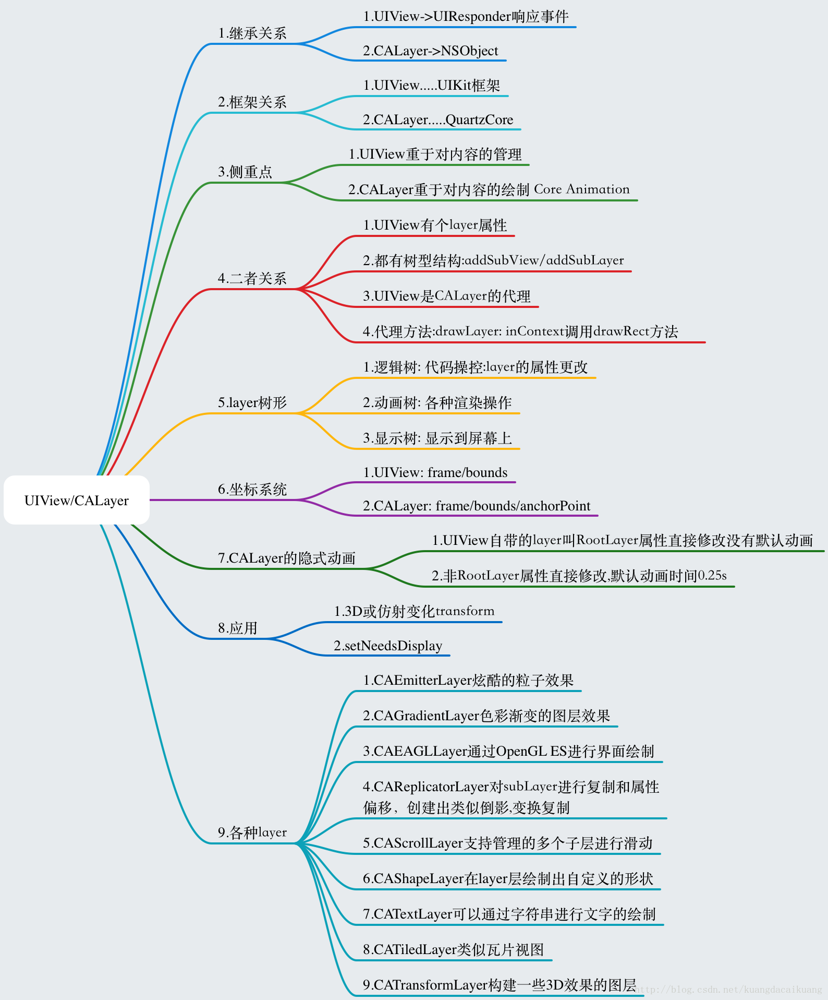

## UIKit

- 1.`UIView` 和 `CALayer` 是什么关系？

  


- 2.`Bounds` 和 `Frame` 的区别? 

Bounds相对于整个视图的坐标的相对位置

Frame相对于父视图的坐标的相对位置

- 3.`TableViewCell` 如何根据 `UILabel` 内容长度自动调整高度?

  

- 4.`LoadView`方法了解吗？

  

- 5.`UIButton` 的父类是什么？`UILabel` 的父类又是什么？

- 6.实现一个控件，可以浮在任意界面的上层并支持拖动？


- 7.说一下控制器 `View` 的生命周期，一旦收到内存警告会如何处理？


- 8.如何暂停一个 `UIView` 中正在播放的动画？暂停后如何恢复？


- 9.说一下 `UIView` 的生命周期？

  

- 10.`UIViewController` 的生命周期？

viewDidLoad->viewWillAppear-> viewDidAppear-> viewWillDisAppear-> viewDidDisAppear

- 11.如何以通用的方法找到当前显示的`ViewController`? 

1.先去找到keyWindow

2.找到keyWindow的跟控制器`window.rootViewController `

3.

```objective-c
+ (UIViewController *)findCurrentViewController {
    UIViewController *result = nil;
    UIWindow * window = [[UIApplication sharedApplication] keyWindow];
    if (window.windowLevel != UIWindowLevelNormal) {
        NSArray *windows = [[UIApplication sharedApplication] windows];
        for(UIWindow * tmpWin in windows) {
            if (tmpWin.windowLevel == UIWindowLevelNormal) {
                window = tmpWin;
                break;
            }
        }
    }
    result = window.rootViewController;
    while (result.presentedViewController) {
        result = result.presentedViewController;
    }
    if ([result isKindOfClass:[UITabBarController class]]) {
        result = [(UITabBarController *)result selectedViewController];
    }
    if ([result isKindOfClass:[UINavigationController class]]) {
        result = [(UINavigationController *)result visibleViewController];
    }
    return result;
}
```

- 12.`setNeedsDisplay` 和 `layoutIfNeeded` 两者是什么关系？

