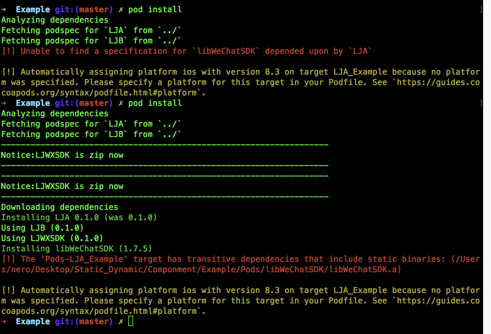

# 启动时间优化

## 编译原理

### 静态库

链接时会复制到可执行文件中，如果两个程序同时使用静态库那么就会复制两份静态库。

### 动态库

链接时不复制，在程序启动后用 dyld 加载，然后再决议符号，所以理论上动态库只用存在一份，好多个程序都可以动态链接到这个动态库上面，达到了节省内存(不是磁盘是内存中只有一份动态库)，还有另外一个好处，由于动态库并不绑定到可执行程序上，所以我们想升级这个动态库就很容易，windows 和 linux 上面一般插件和模块机制都是这样实现的。但是在目前如果一个程序的APP Extension中是可以使用一个阉割的动态库，因为目前苹果的动态库上架前需要签名不允许动态下发。

### 编译和链接

编译：将源代码编译为目标文件（.o文件）
链接：将我们的各种目标文件加上一些第三方库，和系统库链接为可执行文件。

在目标文件中的符号(变量和函数)可能来自其他的目标文件，链接这个过程就是操作决议符号的地址


- 若符号来⾃静态库(本质就是.o 的集合包)或 .o，将其纳⼊链接产物，并确定符号地址
- 若符号来⾃动态库，打个标记，等启动的时候再说---交给 dyld 去加载和链接符号

### 静态库与动态库互相依赖问题

1. libA.a dependency libB.a
2. UIKit.dylib dependency Foundation.dylib
3. libA.a dependency Foundation.dylib
4. MyXX.dylib dependency libA.a

- 第一种情况静态库依赖静态库这种情况比较常见，一般情况下可能会出现 libA 与 libB 中同时包含相同库 libC 在打包后会将libC 移除静态库，否则会出现符号相同。

- 第二种动态库依赖动态库，两个动态库是相互隔离的具有`隔离性`，但是制作的静态库的时候需要被依赖动态库参与链接，但是具体的符号决议交给`dyld`来做。

- 第三种，静态库依赖动态库，也很常见，静态库制作的时候也需要动态库参与链接，但是符号的决议交给 dyld 来做。

- 第四种，动态库依赖静态库，这种情况就有点特殊了。首先我们设想动态库编译的时候需要静态库参与编译，但是静态库交由 dyld 来做符号决议，but 这和我们前面说的就矛盾了啊。静态库本质是一堆.o 的打包体，首先并不是二进制可执行文件，再者你无法保证主程序把静态库参与链接共同生成二进制可执行文件。这就尴尬了。
  怎么办？
  目前的编译器的解决办法是，首先我无法保证主程序是否包含静态库，再者静态库也无法被`dyld`加载，那么我直接把你静态库的.o 偷过来，共同组成一个新的二进制。也被称做`吸附性`

  那么我有多份动态库都依赖同样的静态库，这就尴尬了，每个动态库为了保证自己的正确性会把静态库吸附进来。然后两个库包含了同样的静态库，于是问题就出现了。 

可执⾏⽂件（主程序或者动态库）在构建的链接阶段
  - 遇到静态库，吸附进来
  - 遇到动态库，打标记，彼此保持独⽴



第四种情况一般会出现如上问题，`The XXXX target has transitive dependencies that include static binaries`，在打包私有库 `Agamotto`的情况时，由于可能经常改动没有被打包为静态库，作为私有 `pod` 引入由于`podfile`使用了`use_frameworks`所以在编译后都会编译为动态库的形式，`Agamotto`会依赖另一个基础库`Tesseract`(已打包静态库)，就会出现 `pod install` 不成功的情况，也就是动态库的吸附性问题，上图中同样会出现多个动态库吸附一个静态库问题。

### 私有库打包一些问题

[Cocoapods 私有化踩坑](http://adolsai.com/index.php/archives/cocoapods-private-error-list.html)

### 常用命令

```ruby
lipo XXX -thin armv7 -output XXX_armv7.a
ar -x XXX_armv7.a
```

优化前动态库

```objective-c
Total pre-main time: 1.2 seconds (100.0%)
         dylib loading time: 243.65 milliseconds (20.1%)
        rebase/binding time: 140.19 milliseconds (11.5%)
            ObjC setup time:  86.70 milliseconds (7.1%)
           initializer time: 738.79 milliseconds (61.0%)
           slowest intializers :
             libSystem.B.dylib : 339.12 milliseconds (28.0%)
   libBacktraceRecording.dylib :  32.96 milliseconds (2.7%)
    libMainThreadChecker.dylib :  79.19 milliseconds (6.5%)
                  AFNetworking :  25.47 milliseconds (2.1%)
               AsyncDisplayKit :  98.10 milliseconds (8.1%)
                       Flutter :  25.60 milliseconds (2.1%)
                    sohuMobile : 172.91 milliseconds (14.2%)

  total time: 1.8 seconds (100.0%)
  total images loaded:  496 (456 from dyld shared cache)
  total segments mapped: 122, into 14297 pages
  total images loading time: 607.63 milliseconds (32.8%)
  total load time in ObjC:  86.70 milliseconds (4.6%)
  total debugger pause time: 363.97 milliseconds (19.6%)
  total dtrace DOF registration time:   0.00 milliseconds (0.0%)
  total rebase fixups:  382,104
  total rebase fixups time: 139.51 milliseconds (7.5%)
  total binding fixups: 673,072
  total binding fixups time: 274.04 milliseconds (14.8%)
  total weak binding fixups time:   3.98 milliseconds (0.2%)
  total redo shared cached bindings time: 277.34 milliseconds (14.9%)
  total bindings lazily fixed up: 0 of 0
  total time in initializers and ObjC +load: 738.79 milliseconds (39.9%)
                         libSystem.B.dylib : 339.12 milliseconds (18.3%)
               libBacktraceRecording.dylib :  32.96 milliseconds (1.7%)
                            CoreFoundation :   9.56 milliseconds (0.5%)
                libMainThreadChecker.dylib :  79.19 milliseconds (4.2%)
                              AFNetworking :  25.47 milliseconds (1.3%)
                           AsyncDisplayKit :  98.10 milliseconds (5.3%)
                                   Flutter :  25.60 milliseconds (1.3%)
                                 SHMUBSiOS :   5.89 milliseconds (0.3%)
                                sohuMobile : 172.91 milliseconds (9.3%)
total symbol trie searches:    1550274
total symbol table binary searches:    0
total images defining weak symbols:  52
total images using weak symbols:  119
```


参考资料

[启动时间优化](https://juejin.im/entry/5b596eab6fb9a04fb614f2c6)

[WWDC2019之启动时间与Dyld3](http://www.zoomfeng.com/blog/launch-optimize-from-wwdc2019.html)

### 二进制重排

### 静态库替换动态库

main函数之前执行时间1.2s左右减少到700ms


### 启动时将非必要后置


### 实际操作

①减少依赖不必要的库，不管是动态库还是静态库；如果可以的话，把动态库改造成静态库； 如果必须依赖动态库，则把多个非系统的动态库合并成一个动态库； 

②检查下 framework应当设为optional和required， 如果该framework在当前App支持的所有iOS系统版本都存在，那么就设为required，否则就设为optional， 因为optional会有些额外的检查；

 ③合并或者删减一些OC类和函数； 关于清理项目中没用到的类，使用工具AppCode代码检查功能，查到当前项目中没有用到的类（也可以用根据linkmap文件来分析，但是准确度不算很高）； 有一个叫做[FUI](https://github.com/dblock/fui)的开源项目能很好的分析出不再使用的类，准确率非常高，唯一的问题是它处理不了动态库和静态库里提供的类，也处理不了C++的类模板。

 ④删减一些无用的静态变量

 ⑤删减没有被调用到或者已经废弃的方法， 方法见http://stackoverflow.com/questions/35233564/how-to-find-unused-code-in-xcode-7 和https://developer.Apple.com/library/ios/documentation/ToolsLanguages/Conceptual/Xcode_Overview/CheckingCodeCoverage.html。

 ⑥将不必须在+load方法中做的事情延迟到+initialize中，尽量不要用C++虚函数(创建虚函数表有开销)

 ⑦类和方法名不要太长：iOS每个类和方法名都在__cstring段里都存了相应的字符串值，所以类和方法名的长短也是对可执行文件大小是有影响的； 因还是object-c的动态特性，因为需要通过类/方法名反射找到这个类/方法进行调用，object-c对象模型会把类/方法名字符串都保存下来；

 ⑧用dispatch_once()代替所有的 attribute((constructor)) 函数、C++静态对象初始化、ObjC的+load函数； 

⑨在设计师可接受的范围内压缩图片的大小，会有意外收获。 压缩图片为什么能加快启动速度呢？因为启动的时候大大小小的图片加载个十来二十个是很正常的， 图片小了，IO操作量就小了，启动当然就会快了，比较靠谱的压缩算法是TinyPNG。


### 实践方案

1.把启动时RN包的删除和拷贝操作，仅在APP安装后第一次启动时才做，之后的启动不再做这操作， 而是等到网络请求RN数据回来，根据是否需要更新RN包的判断，再去做这些IO操作从而避免启动的耗时。 iPhone5C能节省1.4s；

2.OSS token的获取不是一个需要在启动的时候必须要做的操作，放到子线程去处理，大部分时候是节省10-15ms，偶尔能去到50ms；

3.去掉启动状态机里的原有定位服务，原来SSZLocationManager的定位服务因为内部依赖高德的SDK， 需要初始化SDK，iPhone5C大概耗时100ms。同时SSZLocationManager这个类代码保留， 但是APP的工程去除对其的依赖；

4.打点统计模块里的定位服务权限请求改成异步，大概有50ms； 

5.阿里百川的Feedback，在网校并没有使用，直接去掉其初始化流程，大概5ms左右； 

6.友盟的分享服务，没有必要在启动的时候去初始化，初始化任务丢到后台线程解决，大概600-800ms； 

7.状态机跑完后的启动内存统计，放到后台去做，大概50ms；

8.UserAgentManager里对于webview是否为UIWebview的判断，以前是新创建一个对象使用对象方法来判断， 修改为直接使用类方法，避免创建对象的消耗，节省约200ms；

9.阿里云的HTTPDNS已经没有再使用了，所以这里也可以直接去掉。大概20-40ms； 

10.SSZAppConfig里把网络请求放到后台线程，这样子就可以配合启动状态机把该任务放到子线程进行初始化了， 否则子线程消耗的时间太长了；

11.采用两个线程来进行启动流程的初始化，用状态机来控制状态的变化。 但是要针对业务区分开，并不是把一部分业务拆分到子线程，就可以让整体的启动速度更快； 因为如果子线程有一些操作是要在主线程做的，有可能会出现等待主线程空闲再继续的情况； 或者当两个线程的耗时操作都是IO时，拆开到两个线程，并不一定比单个线程去做IO操作要快。

12.主UI框架tabBarController的viewDidLoad函数里，去掉一些不必要的函数调用。

13.NSUserDefaults的synchronize函数尽量不要在启动流程中去调用，统一在APP进入后台， willTerminate和完全进入前台后把数据落地；